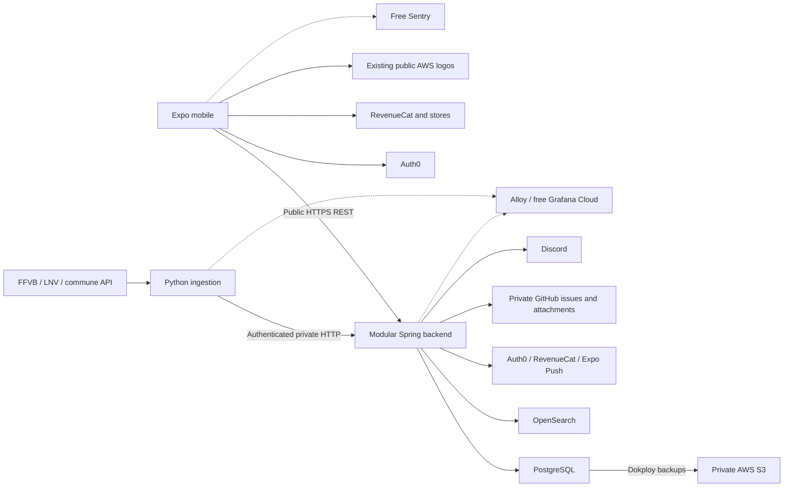

# Blockout technical architecture

## Scope and status

[Architecture #16](https://github.com/blockoutproject/blockout/issues/16) approves the complete V2 backend, ingestion and mobile rebuild. This reference retains its common technical choices; the [owning specifications](../README.md#specifications) define business meaning and each accepted feature plan derives its models, contracts and tasks under the [constitution](../.specify/memory/constitution.md). It is not an executable plan or runtime qualification.

This repository currently contains governance and planning artifacts. Applications, dependencies and environments are not initialized. V1 code and architecture are historical evidence, not the target. Running V1 instances originate from independent repositories; the legacy monorepo is not deployed. Historical evidence grants no permission to inspect those repositories or change production. [F14](../specs/014-v1-v2-transition/spec.md) owns continuity and cutover requirements; [AGENTS.md](../AGENTS.md) owns working and publication instructions.

Build a correct, maintainable application. There is no concurrency or latency target, load test, benchmark, capacity study, monthly availability accounting or deferred performance program. Useful indexes, pagination, bounded work, transactions and diagnostics remain ordinary correctness. Domain-owned timing remains functional behavior.

## Stack

| Responsibility       | Selected technology                                           | Decision status and source                                                        | Implementation evidence             |
| -------------------- | ------------------------------------------------------------- | --------------------------------------------------------------------------------- | ----------------------------------- |
| Backend              | Java 25 LTS, Spring Boot 4.1, MVC and Security                | Approved in #16; [F13 plan](../specs/003-shared-quality/plan.md)                  | Not initialized                     |
| Module checks        | Spring Modulith 2.1 verification only                         | Acyclic module interfaces; no persistent event registry                           | Not executed                        |
| Business persistence | PostgreSQL 18, Spring Data JPA, targeted SQL/read projections | One business database per environment                                             | Not initialized                     |
| Schema changes       | Liquibase Community 5, XML                                    | Distinct deployment step                                                          | Not executed                        |
| Search               | OpenSearch 3.9                                                | Rebuildable projection for [F04](../specs/008-search-discovery/spec.md) semantics | Not initialized                     |
| Acquisition          | Python 3.14, HTTPX, lxml, standard CSV, APScheduler 3         | [F01 plan](../specs/001-source-acquisition/plan.md)                               | Not initialized                     |
| Mobile               | Expo SDK 57, React Native 0.86, React 19.2                    | Complete internal rebuild; accepted baseline minimum iOS 16.4 / Android 7         | Native builds not qualified         |
| Workspace/build      | Nx 23, Node.js 24 LTS, npm; Maven Wrapper and uv              | Nx orchestrates language-owned commands                                           | Not initialized                     |
| Contracts            | OpenAPI 3.0.3, OpenAPI Generator, Orval, Zod                  | Source-first generation under F13                                                 | Consumers not generated or compiled |

Lock stable compatible patch versions, wrappers, dependencies and images when implementing each approved plan. Do not use floating `latest` or prereleases; a generation change requires an explicit decision. These selected baselines do not certify compatibility.

## Runtime boundaries

The selected locations are `apps/backend`, `apps/ingestion`, `apps/mobile`, `contracts/public`, `contracts/internal`, `infra/local` and `infra/dokploy`. Create only what approved plans/tasks require. One Maven project holds the backend modules. Nx invokes Maven, uv and npm with explicit inputs, outputs and dependencies; no Nx Cloud or experimental Nx Maven plugin is selected. Shared libraries require concrete shared meaning and an owner.

| Application/module      | Responsibility and owning source                                                                                                                                                                     |
| ----------------------- | ---------------------------------------------------------------------------------------------------------------------------------------------------------------------------------------------------- |
| Backend `sport`         | Authoritative sporting identities, relationships, integration, effective values and visibility: [F02](../specs/002-sporting-data/spec.md), [derived model](../specs/002-sporting-data/data-model.md) |
| Backend `accounts`      | Business accounts, Auth0 correspondence, age, permissions and erasure: [F05](../specs/005-accounts-identity/spec.md)                                                                                 |
| Backend `following`     | Follow relationships and intent: [F06](../specs/009-following-personal-feed/spec.md)                                                                                                                 |
| Backend `contributions` | Link versions, quota facts, reports and moderation: [F08](../specs/010-live-contributions-moderation/spec.md)                                                                                        |
| Backend `subscriptions` | RevenueCat correspondence and lifecycle cleanup: [F09](../specs/006-pro-subscriptions/spec.md); SDK owns mobile rights, console owns gifts                                                           |
| Backend `notifications` | Inbox/read state, installation bindings, non-personal match facts, audience and best-effort push: [F07](../specs/011-notifications-delivery/spec.md)                                                 |
| Backend `assistance`    | Immutable submitted operation and complete private GitHub correspondence: [F10](../specs/012-reports-feature-suggestions/spec.md)                                                                    |
| Backend `configuration` | Maintenance/version settings: [F12](../specs/013-administration-app-configuration/spec.md); legal publication: [F11](../specs/004-advertising-privacy-legal/spec.md)                                 |
| Backend `acquisition`   | Source/family controls, cycles, acquisition/integration diagnostics: [F01](../specs/001-source-acquisition/spec.md)                                                                                  |
| Backend `search`        | Rebuildable index and indexing progress, never sporting truth: [F04](../specs/008-search-discovery/spec.md)                                                                                          |
| Python ingestion        | Supplier fetching, parsing and normalized observations; F01 owns adaptation to the F02 integration contract                                                                                          |
| Mobile                  | Navigation and interaction; consumes current owned business projections, identity/provider SDKs and approved design                                                                                  |

Consultation and personal-feed queries compose owned data without creating a second sporting owner. Transition tooling is temporary, not a new runtime domain. Each backend module owns its PostgreSQL schema, repositories and meaningful business/application interfaces. A schema is not a separate service or security isolation under shared credentials. Use thin controllers, application use cases and owned persistence/provider adapters; generated transport objects and JPA/provider representations stay at their boundaries. Do not access another module's repositories.

Explicit coordinators implement cross-module workflows above their owners. Spring Modulith verifies allowed interfaces and acyclic dependencies. The selected modular backend avoids distributed business transactions while retaining the independent Python source boundary. An unstructured monolith, server-side supplier acquisition in Spring and autonomous services per domain were rejected. No BFF, broker, implicit listener chain, local event bus or service per entity is selected. A separate service needs a concrete operational or delivery reason.

## Technical constraints

### Transactions and contracts

A coherent business mutation uses one PostgreSQL transaction, including necessary coordinated cross-module writes. SQL uniqueness/references protect identity; expected revisions protect current intent. Use targeted locks for genuinely concurrent decisions rather than global serializable isolation. External HTTP does not run inside SQL transactions. Source mutations record needed indexing/notification work atomically; external effects follow commit. A lost response does not prove rollback. Use current-state rereads where sufficient, without a universal receipt/retry protocol.

Public versioned REST JSON serves mobile journeys; ingestion has separate authenticated private HTTP. Structured errors use stable codes and non-sensitive diagnostic references. Requests are strict; responses tolerate unknown additive fields while validating consumed fields. Unknown values never grant permission. Breaking behavior needs a compatible versioned API under the supported mobile policy. Pagination follows the owning journey; no universal pagination layer, GraphQL or WebSocket is selected.

Version contract sources. Reproduce bundles, Java interfaces/DTOs, Python HTTPX clients and TypeScript clients/validators outside Git before consumer builds. OpenAPI Generator owns Java/Python output; Orval/Zod owns mobile generation. Qualify actual generated enum/date/error handling and response validation. F13 owns the [contract pipeline](../specs/003-shared-quality/contracts/); V1 wire schemas, manifests and generated outputs are not input templates for V2.

### Acquisition and deferred work

Python never writes business SQL. Provider adapters remain distinct from scheduling and the generated internal client; HTTPX/lxml/CSV are selected without Scrapy or browser automation absent an actual source need. F01 owns [coverage, cadence, observations, source locking and ordinary recovery](../specs/001-source-acquisition/spec.md); F02 owns integration and absence/visibility consequences. The [F01 plan](../specs/001-source-acquisition/plan.md) and [F02 contracts](../specs/002-sporting-data/contracts/) define their technical boundary.

Use one active APScheduler process per environment, current configuration at cycle start and the approved five-second backend control poll. Source work has bounded concurrency/timeouts and at most two additional transient-read attempts respecting `Retry-After`; parsing failure is not retried. Do not add overlapping normal cycles, catch-up queues or fine-grained download resumption. Acquisition success, integration acceptance and projection completion remain distinct.

Spring's bounded background work is limited to the jobs actually required by its owners: pending F07 notification work/ordinary provider receipt handling and F04 latest-state indexing use five-second passes without overlapping the same treatment; domain purges retain their own cadence. F05 cleanup performs its normal post-commit attempt, with unresolved exceptions handled manually; F09 has no backend entitlement-refresh scheduler. This reference creates no generic job for unresolved operations or provider events. No RabbitMQ, Kafka, Celery, Quartz, Redis, workflow engine or universal retry ledger is selected.

| Failure                              | Common boundary                                                                                                            |
| ------------------------------------ | -------------------------------------------------------------------------------------------------------------------------- |
| Supplier/collector failure           | Existing accepted sport remains; bounded read retries and next eligible cycle or manual correction under F01               |
| Search indexing failure              | Source transaction stays accepted; next pass indexes latest state; unavailable search reports failure explicitly           |
| Push uncertainty                     | Use ordinary provider evidence and best effort under F07; no claim of exactly-once handset delivery                        |
| Partial/uncertain support upload     | F10 owns complete acceptance and reread before retry; exceptional duplicates may be resolved manually                      |
| External account cleanup uncertainty | F05 keeps the targeted lifecycle blocked and original references identifiable; manual resolution cannot target a successor |
| Database/VPS loss                    | Dependent operations fail explicitly; external detection and manual repair/restore, without fabricated success or HA claim |

### Search and mobile

OpenSearch is selected for F04's typo, prefix, alias, filter, ranking and exhaustive pagination semantics. PostgreSQL-only full-text/trigram search offers fewer components but needs more custom relevance work; Elasticsearch offers no currently required advantage. PostgreSQL remains truth. Index only effective authorized fields; mark resources/revisions within source transactions, reread latest state for indexing and check current visibility/version before returning hits. Use point-in-time plus `search_after` and a stable identity tie-breaker. Expired cursors require refresh. Build/validate a replacement index before switching its alias; keep the prior usable index during rebuilding. No SQL fallback with different semantics or general server cache is selected.

Expo Router owns thin routes; features own behavior. TanStack Query owns server state, React state/narrow Context local interaction, React Hook Form/Zod forms. No initial Redux, Zustand, SQLite, persisted server-query cache or offline mutation queue is selected for production. AsyncStorage holds small non-secret preferences and required lifecycle markers; Auth0's secure credentials manager owns tokens. Query keys include relevant session/context; changing account clears private state, cancels work and rejects old results. Lifecycle checks follow their owner without general polling. F12 now requires a complete cold-start check and explicit retry, with current-process restrictions/revisions and no persisted access configuration. F07 owns inbox-age cleanup.

Use StyleSheet, approved Figma tokens, FlatList/SectionList and expo-image. [Design references](design.md) identify visual authorities; F13 owns accessibility and quality, including screen readers, text enlargement, reduced motion, focus and 44-point targets. Loading, empty, denied, failed and uncertain states keep useful exits.

| Native/provider boundary   | Selected integration                                                                                                                                       |
| -------------------------- | ---------------------------------------------------------------------------------------------------------------------------------------------------------- |
| Maps and commune geocoding | react-native-maps: Apple Maps on iOS, Google Maps on Android; `geo.api.gouv.fr`; municipal display needs no GPS permission; F01/F02/F14 own point evidence |
| Advertising                | AdMob, react-native-google-mobile-ads, UMP; no initial mediation; F09/F11 own entitlement/consent behavior                                                 |
| Attachments                | Expo selection/preparation; F10 owns image limits, actual PNG/JPEG validation and removal of irrelevant metadata; a picker option is not proof             |
| Documents and links        | System/suitable browser opening with actual PDF/native qualification; Universal/App Links and provider callbacks confer no permission                      |
| Crash reporting            | Free Sentry, initially without analytics, replay or profiling                                                                                              |

### Identity, external operations and retained data

Use Auth0 Authorization Code with PKCE in the system browser; Spring validates signature, issuer, audience and expiry. Resolve issuer/subject to explicit business UUIDs. F05 owns existing links, non-unique contact emails, lifecycle/age and current action/resource permissions, including the accepted standard-token limitation after same-subject re-registration. No extra business session registry, lifecycle claim or re-registration delay is selected. RevenueCat SDK owns mobile entitlement state/cache/expiry; Spring keeps necessary customer correspondence and cleanup only, without rights projections, grant ledgers, verification endpoints or refresh schedulers. New business lifecycles use opaque provider IDs; console-managed gifts and native restoration follow F09.

Use Expo Push Service/expo-notifications; PostgreSQL owns inbox/read state. F07 owns match facts, audience, composition, retention and best-effort delivery. Do not recreate permanent recipient history or persistent delivery retries. F05/F11 own personal erasure and restrictions before restoration.

Preserve existing public AWS logos, URLs, bytes and club associations. Do not add a CDN or relocate the estate for uniformity; never overwrite objects still needed by V1. F02/F14 own import precedence and unresolved identity/file evidence.

F10 uses a separate private GitHub support destination and native issue attachments. A narrow Spring adapter invokes a pinned official `gh` supporting `--attach`, with separate process arguments, private temporary files, bounded execution and no shell interpolation. Prefer a GitHub App; qualify a repository-restricted fine-grained token only if attachment uploads cannot use its installation credential. No broad permission or private AWS attachment substitute is selected. Partial CLI upload can leave an issue; confirm only complete selected attachments. Qualify actual erasure, not merely link removal. Discord receives the completed issue reference/link only; alert failure cannot reject the ticket. No persistent mobile draft is selected.

Publish F11 legal content as versioned backend files and public read operations, without a mobile editor or write endpoint. Preserve the privacy-page deletion section/direct link. Content intended to reach users is a backend release input, distinct from planning prose.

### Delivery, operations and transition

Preproduction and production initially share a Hostinger VPS managed by Dokploy, with distinct application/PostgreSQL/OpenSearch containers, volumes, databases, secrets and technical identities. Preproduction may stop when unused. One backend and one collector run per environment; stop the old task-running instance before starting its replacement. Short interruptions are accepted. Containers do not isolate host failure or provide HA.

Dokploy terminates public HTTPS. Database/search/internal ingestion endpoints are private; the collector also uses a dedicated technical secret. Separate migration/runtime database credentials. Secrets live in CI/deployment configuration. Bound requests/uploads/work without new product quotas. Validate source destinations/redirects against internal URL access. Logs exclude credentials, contacts, ticket content and raw source documents.

Future runtime CI validates contracts, generation, builds, static checks and relevant tests. Publish immutable GHCR images; deploy `develop` to preproduction and promote the same qualified artifact through `main`. Liquibase runs before application rollout; failure stops it. No Hibernate schema mutation, startup migration or automatic SQL rollback. A software rollback requires compatibility with retained data/schema. Use EAS Build/Submit, initially free, and store releases only; no EAS Update/OTA. Identify the tested artifact and avoid changing it during its test; there is no general test freeze.

Use free Grafana Cloud/Alloy for useful logs/metrics and external host-loss detection. Verify grouped non-repeating opening/recovery notifications to Discord with Grafana IRM; no periodic reminders or monthly availability accounting. Domain incident thresholds remain owned by F01. Respect free quotas; no silent paid upgrade. Hosting, self-hosted data/search, AWS storage/transfer, Auth0/RevenueCat agreements and store/GitHub/GHCR/Google Maps charges require checking actual accounts before activation, without an anticipatory sizing study. A paid EAS plan needs a concrete need and explicit decision.

Dokploy schedules PostgreSQL backups every 30 minutes to private AWS S3 with 30-day retention. This schedule promises neither zero loss nor a guaranteed loss bound. F13 selects hourly periodic AWS Backup for image bytes, also with 30-day retention; use the native problem notifications/history, without last-success absence thresholds or continuous-protection configuration monitoring. Silent scheduling stops may go unalerted. [F13 operations](../specs/003-shared-quality/contracts/operations.md) owns exact retention, diagnostic and restoration obligations. Protect irreplaceable file bytes separately from SQL dumps/URLs. Qualify manual closed-environment restoration and current identity/rights/erasure/privacy obligations before reopening; unresolved affected access stays unavailable. No custom backup/recovery engine is selected.

Prepare V2 separately while V1 remains operational. Use a rehearsed controlled maintenance window and final protected-data refresh, without continuous V1/V2 synchronization or a generic migration platform. Preserve store application identifiers and signing continuity so V2 can update existing installations. F14 owns both-store readiness, old-client/provider interference, continuity and retirement. After opening, repair/restore V2 with standard tools; no functional return to V1. Source inspection, exports, provider changes and production operations require their own explicit authorization.

### Verification ownership

Feature plans define relevant JUnit/Spring and real PostgreSQL/OpenSearch Testcontainers checks, pytest source/integration checks, Jest Expo/React Native Testing Library checks and native device journeys. Generated Java/Python/TypeScript consumer builds and native/provider tests remain implementation obligations. GitHub attachment completeness/privacy/erasure, source interpretation, accepted search behavior, identity/Pro continuity on both stores, every required club/logo association and file, real restoration and alert configuration require actual evidence before their capability is relied upon. A failed qualification blocks that affected capability; documentation checks do not substitute for it. No performance qualification is a prerequisite to this documentary consolidation.

## Decision sources

- [Approved architecture #16](https://github.com/blockoutproject/blockout/issues/16), originally delivered through [legacy PR #306](https://github.com/blockoutproject/blockout-legacy/pull/306) under [#305](https://github.com/blockoutproject/blockout-legacy/issues/305).
- [Specifications and existing dossiers](../README.md#specifications), [planning epic #9](https://github.com/blockoutproject/blockout/issues/9) and [design authorities](design.md). GitHub owns dependencies and acceptance; completing an artifact is not approval.
- [Spring Modulith verification](https://docs.spring.io/spring-modulith/reference/verification.html), [Spring Data JPA transactions](https://docs.spring.io/spring-data/jpa/reference/jpa/transactions.html), [OpenSearch pagination](https://docs.opensearch.org/latest/search-plugins/searching-data/paginate/).
- [Expo platform matrix](https://docs.expo.dev/versions/latest/), [GitHub CLI attachments](https://cli.github.com/manual/gh_issue_create), [Dokploy backups](https://docs.dokploy.com/docs/core/databases/backups), [Grafana free limits](https://grafana.com/pricing/). These describe capabilities, not successful Blockout qualification.
