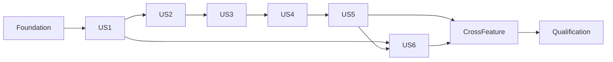

# Tasks: F02 sporting data, integration and lifecycle

**Input**: [plan](plan.md), [specification](spec.md), [research](research.md), [data model](data-model.md), [contracts](contracts/integration.md) and [quickstart](quickstart.md).

**Scope**: future executable implementation only, after dossier/global approval and separate implementation authorization. Writing this list does not execute it. F13 owns scaffolding/toolchain/CI; F01 owns provider acquisition adapters and scheduling. Their integration qualifications below are F02 acceptance responsibilities, not duplicate implementation ownership. No new implementation issues are created here.

**Format**: sequential local `Tnnn`; external references use `002-sporting-data/Tnnn` or the owning directory. `[P]` means independent files after prerequisites; story labels preserve accepted story numbers. Tests are explicitly required by the user/spec: write meaningful failing behavior fixtures before implementing the boundary. All entries remain unchecked.

## Phase 1: Setup

**Goal**: Consume the authorized foundation without duplicating it.

**Independent checkpoint**: F13 foundations available and planning-only bypass already removed before executable edits.

- [ ] T001 Verify global acceptance/implementation authorization and F13 prerequisite completion against `specs/003-shared-quality/tasks.md` and `AGENTS.md`; consume 003-shared-quality/T001–T012, not duplicate scaffolding. [Constitution I/IV/V]
- [ ] T002 Adopt the dossier OpenAPI operations under `contracts/internal/sport/` and `contracts/public/sport/`, referencing F13's single `contracts/shared/schemas/problem.yaml`; retain strict request/additive response roles and ignored generated outputs. [Constitution IV; contracts] Include information-sheet, scoresheet and professional-media observations and their conditional state/value rules.
- [ ] T003 Establish reduced controlled sport fixtures and provenance notes in `apps/backend/src/test/resources/sport/` and `apps/ingestion/tests/fixtures/sport/` from `specs/002-sporting-data/provider-evidence.md`, excluding raw/personal payloads and distinguishing observed from synthetic cases. [FR-027, FR-048; Constitution V]

## Phase 2: Foundational boundaries

**Goal**: Establish concrete sport ownership, security, persistence and transport evidence.

**Independent checkpoint**: Real PostgreSQL test boundary and generated consumers available before story work.

- [ ] T004 Define occupied sport application/domain/persistence boundaries and current permission/clock ports in `apps/backend/src/main/java/com/blockout/sport/`; verify module dependencies in `apps/backend/src/test/java/com/blockout/sport/ModuleBoundaryTest.java`. [Constitution II; plan]
- [ ] T005 Create the sport Liquibase XML entry at `apps/backend/src/main/resources/db/changelog/sport/001-sport.xml` using F13 master/migration wiring; record mutable-baseline eligibility and freeze at first preproduction or earlier retained data in the owning migration documentation. [Constitution II/V; D15]
- [ ] T006 Qualify sport contract generation twice and actual Java/Python/TypeScript consumer validation in `contracts/tooling/tests/sport/`, including state/value conditions, strict nested requests and additive responses; block unsupported generation rather than editing generated code. [Constitution IV; V13] Cover new external-reference observation fields and qualified season startYear across affected consumers.
- [ ] T007 Wire sport safe problem/security handlers and allowlisted diagnostic mapping in `apps/backend/src/main/java/com/blockout/sport/api/`, using F13 defaults; test private route rejection, malformed envelope and denied commands in `apps/backend/src/test/java/com/blockout/sport/api/`. [FR-047, FR-048; V15]

## Phase 3: US1 — Recognize the same sporting resources (P1)

**Goal**: Preserve intended IDs through seasons, phases and rescheduling.

**Independent checkpoint**: V01 / A01–A05: stable intended identity, no invented participant, sheet outage does not block a certain club.

- [ ] T008 [P] [US1] Add identity/normalization/phase/report fixtures with PostgreSQL constraints in `apps/backend/src/test/java/com/blockout/sport/identity/`, covering same-club distinct names, compatible multipool teams with one identity/follow target, distinct club/season/division/gender/format boundaries and significant dots/hyphens, reused references, aliases and unknown club sheets. [FR-001, FR-002, FR-003, FR-004, FR-005, FR-006, FR-007, FR-008, FR-009, FR-010, FR-053; SC-001]
- [ ] T009 [P] [US1] Add normalized participant/context consumer cases in `apps/ingestion/tests/integration/test_sport_identity_mapping.py`, including local equipe changes, club-code ambiguity and recognized future slots without fake IDs. [FR-001, FR-005, FR-008, FR-009, FR-053; SC-001]
- [ ] T010 [US1] Implement club/season/division/pool/team/participation/match identity persistence and resource-specific contextual correspondence constraints in `apps/backend/src/main/java/com/blockout/sport/infrastructure/persistence/` and the sport XML baseline. [FR-001, FR-002, FR-003, FR-004, FR-005, FR-010, FR-021] Persist qualified season startYear from F01 preparation, never match dates or lexical labels.
- [ ] T011 [US1] Implement exact accepted name comparison and verified contextual alias resolution in `apps/backend/src/main/java/com/blockout/sport/domain/identity/`, with collision refusal and no fuzzy/name-only club merge. [FR-006, FR-007, FR-008]
- [ ] T012 [US1] Implement calendar participant/match identification in `apps/backend/src/main/java/com/blockout/sport/application/identity/`; preserve known match on unresolved rename and create certain clubs without waiting for sheets. [FR-005, FR-008, FR-009, FR-053; SC-001]
- [ ] T013 [US1] Expose the scoped controlled technical correspondence operation in `apps/backend/src/main/java/com/blockout/sport/application/identity/`, requiring explicit authorization and declared verified effects without creating an alias/merge UI. [FR-002, FR-007, FR-047, FR-048]

## Phase 4: US2 — Correct classifications without losing continuity (P1)

**Goal**: Apply complete compatible scope corrections or refuse all.

**Independent checkpoint**: V02 / A06–A10: no changed IDs/partial refusal; retained publication differs from missing acquisition input.

- [ ] T014 [P] [US2] Add atomic correction/identity-collision/outside-participation and missing/restored classification scenarios in `apps/backend/src/test/java/com/blockout/sport/classification/`, with real PostgreSQL rollback and stale-revision interleavings. [FR-011, FR-012, FR-013, FR-014; SC-002]
- [ ] T015 [P] [US2] Add division create/rename/active-state/permission cases in `apps/backend/src/test/java/com/blockout/sport/division/`, including case-insensitive duplicates and presentation of inactive divisions. [FR-015, FR-016, FR-047; SC-002]
- [ ] T016 [US2] Implement separate current pack/pool classification and accepted published triple plus revision in `apps/backend/src/main/java/com/blockout/sport/application/classification/`, exposing current acquisition eligibility to F01. [FR-011, FR-012]
- [ ] T017 [US2] Implement scoped lock/recheck/collision planning and atomic correction in `apps/backend/src/main/java/com/blockout/sport/application/classification/`; preserve all identities/relations or return safe conflict scopes. [FR-013, FR-014, FR-048; SC-002]
- [ ] T018 [US2] Implement division presentation/activity and classification administrative controllers in `apps/backend/src/main/java/com/blockout/sport/api/administration/`, with explicit permissions and separate activation/source-hiding consequences. [FR-015, FR-016, FR-047]

## Phase 5: US3 — Receive useful updates despite isolated failures (P1)

**Goal**: Commit valid matches independently and reconcile absence only after proven completion.

**Independent checkpoint**: V03–V04 / A11–A15: 99 valid updates persist, no false withdrawal, replay and late work harmless.

- [ ] T019 [P] [US3] Add 99-of-100, duplicate conflict, lost-response, interrupted-finalization and superseding-cycle PostgreSQL cases in `apps/backend/src/test/java/com/blockout/sport/integration/`. [FR-018, FR-019, FR-021, FR-022, FR-048; SC-003]
- [ ] T020 [P] [US3] Add generated HTTPX request/report fixtures in `apps/ingestion/tests/integration/test_calendar_submission.py`, including source counts versus normalized empty, malformed report and partial outcomes. [FR-017, FR-018, FR-019, FR-020, FR-048; SC-003]
- [ ] T021 [US3] Implement observation admission, current digest/order fence and known-cycle verification in `apps/backend/src/main/java/com/blockout/sport/application/integration/`, using F01's issued-cycle application interface and current restrictions. [FR-017, FR-018, FR-022]
- [ ] T022 [US3] Implement independent match integration transactions and state/value/provenance mapping in `apps/backend/src/main/java/com/blockout/sport/application/integration/`; retain successful writes when another transaction fails. [FR-018, FR-020, FR-021, FR-027; SC-003] Preserve the three source-reference slots independently of result finality, with current provenance and privacy.
- [ ] T023 [US3] Implement guarded calendar finalization in `apps/backend/src/main/java/com/blockout/coordination/`: one qualified current empty observation hides the pool/matches/participations, incomplete processing preserves presence, and stale finalization is refused. No empty counter or failed-cycle coordination input. [FR-019, FR-022, FR-024, FR-043; SC-003, SC-006]
- [ ] T024 [US3] Implement the calendar controller and partial report mapper in `apps/backend/src/main/java/com/blockout/sport/api/integration/`. Verify F01 T021’s generated-client mapping in `apps/ingestion/src/blockout_ingestion/backend/sport_observations.py` against the F02 integration contract, including reference observations without PDF bytes, in `apps/ingestion/tests/integration/`. F01 alone implements that mapper; Python owns neither SQL nor whole-request atomicity. [FR-018, FR-019, FR-021, FR-048]
- [ ] T025 [US3] Qualify F01-owned provider scope/cycle inputs against F02 using `apps/ingestion/tests/integration/test_calendar_scope.py`: wrong-season/HTTP200-error/false-empty/reused-round cases, retained eligible reference after failed catalog and distinct essential versus secondary failures. [FR-017, FR-018, FR-019, FR-023; SC-003]

## Phase 6: US4 — Read official results and standings (P1)

**Goal**: Select coherent official facts with honest unknown values.

**Independent checkpoint**: V05–V07 / A16–A25: no invented values/winner/rank; invalid detail preserves useful aggregate.

- [ ] T026 [P] [US4] Add designated-source/clear/finality/special-score/sets/DST cases in `apps/backend/src/test/java/com/blockout/sport/results/`, including stale source evidence, golden-set unknown and undated/date-only schedules. [FR-020, FR-023, FR-024, FR-025, FR-026, FR-027, FR-028, FR-029, FR-030, FR-031, FR-032, FR-033; SC-004]
- [ ] T027 [P] [US4] Add official ranking row/order/ratio/unlinked-team and independent failure cases in `apps/backend/src/test/java/com/blockout/sport/ranking/`. [FR-034, FR-035, FR-036; SC-005]
- [ ] T028 [US4] Implement designated-source validation, retained explicit-clear markers and compatible aggregate/detail selection in `apps/backend/src/main/java/com/blockout/sport/domain/results/`, keeping pure values free of generated types. [FR-023, FR-024, FR-025, FR-026, FR-028, FR-029, FR-030, FR-031]
- [ ] T029 [US4] Implement date-only/reliable-instant mapping and provenance persistence in `apps/backend/src/main/java/com/blockout/sport/application/results/`, with Europe/Paris/DST and FFVB unknown-midnight rules. [FR-027, FR-032, FR-033]
- [ ] T030 [US4] Implement atomic current ranking persistence and internal controller in `apps/backend/src/main/java/com/blockout/sport/application/ranking/` and `apps/backend/src/main/java/com/blockout/sport/api/integration/`, retaining one designated-source table and optional safe links. [FR-034, FR-035, FR-036; SC-005]
- [ ] T031 [US4] Qualify F01 adapter outputs with reduced cases in `apps/ingestion/tests/providers/`: one complete FFVB CSV per qualified pool/tours plus necessary HTML, LNV three championships/phases and per-match five-minute H−1/H+4 detail windows and thirty-minute reads otherwise, including final results; a stable aggregate with changed sets must update. [FR-023, FR-024, FR-029; D05, D06, D17]
- [ ] T032 [US4] Qualify source correspondences, representation-specific gzip/304 and bounded reused HTTP downloads through `apps/ingestion/tests/integration/test_provider_qualification.py` with F01's actual adapters; leave unproven page/phase/season mappings unresolved and block dependent enrichment. [FR-005, FR-017, FR-023, FR-024, FR-027; V05]

## Phase 7: US5 — Understand disappearance and recover retained history (P1)

**Goal**: Keep independent visibility reasons and safe reappearance.

**Independent checkpoint**: V04/V08 / A26–A32: retained IDs, no stale resurrection, correct historical and catalog distinctions.

- [ ] T033 [P] [US5] Add cumulative reasons, single-empty pool hiding, catalog return and authoritative match return cases in `apps/backend/src/test/java/com/blockout/sport/visibility/`. [FR-024, FR-037, FR-038, FR-039, FR-040, FR-042, FR-044; SC-006]
- [ ] T034 [P] [US5] Add pre-closure initial historical nonempty/empty, terminal closed-season refusal, already-running-cycle completion and source-order cases in `apps/backend/src/test/java/com/blockout/sport/history/`. [FR-010, FR-019, FR-043; SC-006]
- [ ] T035 [US5] Implement current visibility/presence state and guarded catalog/calendar transitions in `apps/backend/src/main/java/com/blockout/sport/application/visibility/`, including participation-derived team availability, clubs retained and pool empty reason independent from catalog presence. [FR-024, FR-037, FR-038, FR-039, FR-040, FR-042]
- [ ] T036 [US5] Expose current visibility and fact views through `apps/backend/src/main/java/com/blockout/sport/application/views/`; integrate exact-scope source hiding and reappearance while preserving follows and closed-season identities. [FR-010, FR-032, FR-033, FR-042, FR-043, FR-044]
- [ ] T037 [US5] Qualify all affected F03/F04/F06 consumers in `apps/backend/src/test/java/com/blockout/coordination/SportVisibilityConsumersTest.java`, using real PostgreSQL/OpenSearch for stale hits, deep links, undated matches, feed/maps and ranking rows without hidden links. [FR-032, FR-035, FR-038, FR-039, FR-040, FR-044; SC-006]

## Phase 8: US6 — Maintain presentation and useful club locality (P2)

**Goal**: Preserve authorized edits, actual logo bytes and current qualified commune points.

**Independent checkpoint**: V09–V11/V16 / A33–A39: no stale edit, arbitrary point, lost valid logo or permission bypass.

- [ ] T038 [P] [US6] Add independent name/contact mode, current source return, lost-response/reread, revoked session and F11 suppression cases in `apps/backend/src/test/java/com/blockout/sport/presentation/`. [FR-045, FR-047, FR-048, FR-049; SC-007]
- [ ] T039 [P] [US6] Add byte-size/type/S3-failure/V1-preservation/inheritance/late-upload cases in `apps/backend/src/test/java/com/blockout/sport/logos/`. [FR-043, FR-046; SC-007]
- [ ] T040 [P] [US6] Add effective locality and old-context concurrency cases in `apps/backend/src/test/java/com/blockout/sport/locality/`, plus pure candidate matching acceptance cases in `apps/ingestion/tests/providers/test_commune_matching.py`. [FR-049, FR-050, FR-051, FR-052; SC-007]
- [ ] T041 [US6] Implement current source fields, independent manual modes and revision-checked commands in `apps/backend/src/main/java/com/blockout/sport/application/presentation/` and `apps/backend/src/main/java/com/blockout/sport/api/administration/`; enforce privacy and no contact history. [FR-045, FR-047, FR-048, FR-049, FR-053]
- [ ] T042 [US6] Implement backend logo validation/storage adapter and conditional association in `apps/backend/src/main/java/com/blockout/sport/infrastructure/logos/` and `apps/backend/src/main/java/com/blockout/sport/application/logos/`; fresh objects, permission recheck, old logo retained, no shared/V1 deletion. [FR-046, FR-047, FR-048]
- [ ] T043 [US6] Implement the qualified F14 logo-import acceptance seam in `apps/backend/src/main/java/com/blockout/sport/application/logos/`, requiring protected bytes/hash and certain correspondence/current import revision; preserve unresolved manifest and newer V2 edits. [FR-043, FR-046; SC-007]
- [ ] T044 [US6] Implement effective municipality need/revision and conditional result publication in `apps/backend/src/main/java/com/blockout/sport/application/locality/` and internal API; integrate F01 timing/retry suppression without a new scheduler. [FR-049, FR-050, FR-051, FR-052]
- [ ] T045 [US6] Qualify club/locality contract conformance in `apps/ingestion/tests/integration/` using the F01-owned mapper `apps/ingestion/src/blockout_ingestion/backend/sport_observations.py` and F01 T021/T028/T029 outputs. Verify no first-score matching or season-filtered club/geocoding requests; do not implement a second mapping adapter. [FR-049, FR-050, FR-051, FR-052, FR-053]
- [ ] T046 [US6] Integrate F02-owned presentation/logo actions with F12's accepted journeys in `apps/mobile/src/features/sport/` and tests under `apps/mobile/src/features/sport/__tests__/`, using generated clients, F13 transport and safe stale/conflict rereads; add no new contact/merge screen. [FR-045, FR-046, FR-047, FR-048; SC-007]
- [ ] T047 [US6] Qualify affected iOS/Android selection/upload/rendering/accessibility and old-session behavior using `specs/002-sporting-data/quickstart.md` V16; attach native evidence to owning GitHub work, not a repository status file. [FR-045, FR-046, FR-047, FR-048; Constitution III; SC-007]

## Phase 9: Cross-feature qualification and delivery

**Goal**: Complete only the actual collaborating boundaries and release evidence.

**Independent checkpoint**: All selected scenarios pass; unavailable evidence blocks its capability rather than becoming a claimed success.

- [ ] T048 Implement and test concrete sport/search/notification local coordination in `apps/backend/src/main/java/com/blockout/coordination/` and its tests, recording actual changed revisions only, suppressing historical announcements under F07 and deferring external calls beyond SQL. [FR-021, FR-022, FR-027, FR-044; V12]
- [ ] T049 Qualify real PostgreSQL clean schema and retained upgrade when frozen in `apps/backend/src/test/java/com/blockout/sport/migration/`; ensure separate Liquibase failure stops deployment and applied history is never rewritten. [Constitution II/V; V14]
- [ ] T050 Run whole-application/contract checks through F13's committed targets and all applicable `specs/002-sporting-data/quickstart.md` scenarios, including safe diagnostics, real provider correspondence/coverage gates and actual native/storage consumers; report unavailable proof honestly. [FR-027, FR-048; SC-001, SC-002, SC-003, SC-004, SC-005, SC-006, SC-007; Constitution IV/V]
- [ ] T051 Reconcile final artifacts and owner acceptance using `specs/002-sporting-data/checklists/sporting-design.md` and the official read-only analysis procedure, then follow `AGENTS.md` for the current lifecycle; create no implementation issues before global approval. [Constitution I/V; plan finalization]

FR-041 is withdrawn by the approved KISS revision: no manual pack/pool exclusion command or implementation task remains. Its identifier is retained in the specification for historical traceability.

## Dependencies and implementation order

- Setup T001–T003 precedes foundation T004–T007. T002 precedes T006; T004/T005 precede story persistence work. Complete foundation before stories. F13 prerequisites are `003-shared-quality/T001–T012`; actual identity/session wiring additionally consumes F05, and F13 session transport tasks when mobile begins.
- US1 precedes US2/US3 core implementation. Their first test groups may be written independently after foundation. US2 supplies current classification to US3; US3 uses issued cycles from F01's application interface, with a controlled double only for isolated tests. No later F01 plan is a prerequisite to this documentary plan.
- US4 follows identity/integration; result/ranking test files may proceed independently. F01 owns production CSV/HTML/commune adapters and cadence. F01 T008/T021 owns generated-client setup and mapping; F02 T024 consumes T021 for integrated conformance, while T045 consumes T021/T028/T029. F02’s authored contract is available before these implementations, so no complete-dossier implementation cycle is required. Adapter qualification requires actual F01 implementations; do not add mappers or schedulers to F02.
- US5 follows US2–US4 acceptance/authority state. US6 core presentation tests can start after identity; integration uses current restrictions/fields from US3/US5. Native admin work requires F12 journeys, F05 permissions and F13 mobile transport. F14 supplies actual protected manifest/bytes for real import proof.
- Within each story: listed tests precede their implementation; schema/model then use case then controller/client. Tasks touching the same sport XML, API package or backend client adapter are sequential even across stories.
- The cross-feature coordinator task depends on actual F04/F07 module interfaces, with their accepted specs governing the interaction until their plans exist. Cross-consumer US5 acceptance needs F03/F04/F06. Their absence does not block isolated F02 design/tests, but blocks claims of full consumer completion.
- Final qualification follows all applicable stories/coordinators. Every code change runs F13 whole backend/collector/mobile/contracts checks. Do not wait until the final task to run meaningful boundary tests.

## Parallel opportunities

| Story | Safe independent work after prerequisites                                                           |
| ----- | --------------------------------------------------------------------------------------------------- |
| US1   | T008–T009: distinct behavioral fixture/test files; join before the subsequent implementation tasks. |
| US2   | T014–T015: distinct behavioral fixture/test files; join before the subsequent implementation tasks. |
| US3   | T019–T020: distinct behavioral fixture/test files; join before the subsequent implementation tasks. |
| US4   | T026–T027: distinct behavioral fixture/test files; join before the subsequent implementation tasks. |
| US5   | T033–T034: distinct behavioral fixture/test files; join before the subsequent implementation tasks. |
| US6   | T038–T040: distinct behavioral fixture/test files; join before the subsequent implementation tasks. |

Parallel examples are opportunities, not instructions to spawn agents or run provider calls concurrently. Do not edit the same shared schema/client package in parallel.

## Incremental strategy

The first independently demonstrable increment is foundation plus US1 identity using controlled observations and real PostgreSQL. It is not permission to publish incomplete sporting data: authority, visibility and privacy gates still apply. Add US2–US5 before claiming reliable public sporting lifecycle; add US6 for authorized editing/locality/logo continuity. Each story has its own checkpoint above, while full cross-feature acceptance waits for actual owning consumers. No performance work or speculative recovery machinery is deferred by this list.
